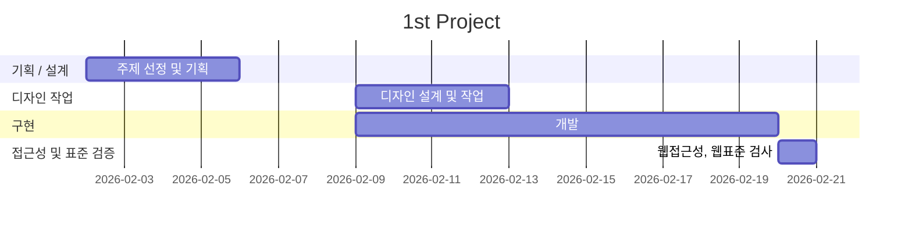

# 3rd Project
- 과정명:오르미 프론트엔드 개발자 양성
- 기간:2025.10.16 ~ 2026.03.04
- 3차 프로젝트:2026.02.02 ~ 2026.03.05

## 빠른링크
- 기획서(피그마 슬라이드):[피그마 슬라이드](https://www.figma.com/slides/b0QzNY83mmF9ygsS26n6oO)
- 디자인 원본(피그마):[디자인 원본 링크](https://www.figma.com/design/A1zY5HdyOrhvFBzTvhYRIA/%ED%94%84%EB%A1%9C%EC%A0%9D%ED%8A%B8?node-id=0-1&t=qXmYqWLdMZz3DEa8-1)

## 1. 프로젝트 개요
### 한줄 소개
- **한줄 소개**: 오늘 뭐 먹지?’  매일 반복되는 메뉴 고민을, 가진 재료로 추천하는 AI 레시피 서비스

### 1.1 목표
- **AI 기반 레시피 생성 + 공유 플랫폼**: ALAN AI 를 통한 레시피 생성과 공유 서비스 구현
- **next.js , ts 사용 경험, 협업 경험**: next.js와 ts 를 작성하며 그 과정에서 협업을 하는 경험 쌓기
- **supabase를 활용한 데이터 베이스 경험**: supabase를 통해 CLUD를 구현하며 데이터 베이스 활용 경험 쌓기
- **취업용 포트폴리오 활용**

### 1.2 팀원
| 이름 | 역할 | 주요 담당 | GitHub | 연락 |
| --- | --- | --- | --- | --- |
| 오세찬 | 팀장 | 메인페이지, 레시피 생성,수정 , 레시피 상세, AI 구현 | [@oh108899@gmail.com] | oh108899@gmail.com |
| 김미경 | 팀원 | 검색창, 검색결과 구현| [@meekyung09111@gmail.com] | meekyung09111@gmail.com |
| 김진선 | 팀원 | 로그인,북마크,마이페이지, 다크 모드 구현 | [@steamedbun.lab@gmail.com] | steamedbun.lab@gmail.com |

### 1.3 마일스톤

#### 1주차: 기획/설계
- [ ] 타 사이트 장단점 분석
- [ ] 타 사이트 벤치마킹
- [ ] 전체적인 사이트의 컨셉 구상

#### 2주차: 디자인 작업
- [ ] 디자인 작업 진행
- [ ] 디자인 작업 마무리

#### 3,4주차: 개발
- [ ] next.js 작성
- [ ] 데이터 베이스 구현
- [ ] AI 연동

### 5주차: 검증 및 배포
- [ ] 배포 오류 검사




### 1.4 주요 기능

- 사용자 인증
- 레시피 CLUD
- AI 레시피 생성 및 필요시 유저가 수정
- supabase를 활용한 데이터 테이블, 스토리지 관리
- 북마크 등 유저 편의 기능 구현
- 댓글과 같은 커뮤니티 기능 구현

### 1.5 ERD


## 2. 개발 환경 및 배포

### 2.1 개발 스택
#### **Frontend**
- next.js

#### **Tools**
- **Version Control**: Git & GitHub
- **Deployment**: VS-code
- **Design**: Figma

#### **배포**
- vercel

### 2.2 배포 URL
- https://nyamnyam-box.vercel.app/


## 3.프로젝트 구조
```
남남박스/
├── public/                        
│   ├── images/
│   └── favicon.ico
├── src/
│   ├── app/                       # Next.js App Router
│   │   ├── layout.tsx
│   │   ├── globals.css
│   │   ├── page.tsx               # 메인 페이지
│   │   ├── page.module.css
│   │
│   │   ├── login/                 # 로그인 페이지
│   │   │   ├── page.tsx
│   │   │   └── page.module.css
│   │   │
│   │   ├── my/                    # 마이페이지
│   │   │   ├── page.tsx
│   │   │   └── page.module.css
│   │   │
│   │   ├── bookmark/              # 북마크 페이지
│   │   │   ├── page.tsx
│   │   │   └── page.module.css
│   │   │
│   │   ├── recipes/
│   │   │   ├── page.tsx           # 레시피 목록
│   │   │   ├── page.module.css
│   │   │   │
│   │   │   ├── new/               # 레시피 작성
│   │   │   │   ├── page.tsx
│   │   │   │   └── page.module.css
│   │   │   │
│   │   │   ├── [id]/              # 상세 페이지
│   │   │   │   ├── page.tsx
│   │   │   │   ├── page.module.css
│   │   │   │   └── edit/          # 수정 페이지
│   │   │   │       └── page.tsx
│   │   │
│   │   └── search/
│   │       ├── page.tsx
│   │       └── results/
│   │           ├── page.tsx
│   │           └── page.module.css
│   │
│   ├── components/                # 공통 컴포넌트
│   │   ├── layout/
│   │   │   ├── Header.tsx
│   │   │   └── Footer.tsx
│   │   │
│   │   ├── recipes/
│   │   │   ├── RecipeCard.tsx
│   │   │   ├── CommentClient.tsx
│   │   │   └── RecipeHeaderActions.tsx
│   │   │
│   │   └── write/
│   │       ├── OptionSection.tsx
│   │       └── WriteTabs.tsx
│   ├── utils/
│   │   └── supabase/
│   │       └── client.ts
│   └── types/                     # 타입 정의
│       └── recipe.ts
│
├── .env.local
├── next.config.ts
├── package.json
├── tsconfig.json
└── README.md
```

## 4. 아키텍처
Client (Next.js)<br>
        ↓<br>
Supabase Auth<br>
        ↓<br>
Supabase DB (PostgreSQL)<br>
        ↓<br>
Supabase Storage
## 5. AI 생성 흐름:
사용자 입력<br>
   ↓<br>
AI API 요청<br>
   ↓<br>
JSON 응답 파싱<br>
   ↓<br>
상태 반영<br>
   ↓<br>
사용자의 공유 동의<br>
   ↓<br>
DB 저장

## 6. 회고

### 1. 잘한점
#### 오세찬
- 구조 설계 : 레시피, 재료, 단계 별로 테이블을 설계를 잘했다.
- 스켈레톤 UI를 위한 loading, 전송 상태 중복 방지를 위한 summiting state 같이 상태값을 잘 사용하여 안정성을 잘 높인것 같다.
- 빠른 로딩이 중요한 페이지는 서버 컴포넌트를 활용하였고, 상태 관리가 중요한 페이지에서는 클라이언트 컴포넌트를 사용하였다.
#### 김진선
- 회원가입/로그인 부터 시작하여 supabase에 연결하여 db연동을 경험
- 댓글 CRUD 진행, 서버/클라이언트 패턴 이해
#### 김미경
- 종료 시점에 성공하든 실패하든 무조건 실행(finally)해서 “무한 로딩” 방지(setLoadingResults(false))
- await로 “데이터가 실제로 도착한 후 다음 단계로 넘어가도록” 순서 보장


### 2. 도전한 점
#### 오세찬
- RLS 관리를 미흡했지만 도전해봤음. DB 권한 문제에 대해 미흡한걸 체감했다.
- 비동기 처리의 중복 문제로 수정을 많이 하였음.
#### 김진선
- AI 도움을 받았으나 DB와 연결하여 북마크 기능을 학습해가며 기능 구현 완료
#### 김미경
- 초기엔 AI 도움을 많이 받았지만, 팀원들이 작성한 걸 참고해서 수정해나감.

### 3. 다시 한다면
#### 오세찬
- error 부분을 통합
- 타입을 미리 지정을 하고 코드 작성 시작하기
- 데이터 흐름과 DB 권한 우선적 설정
- 조금 더 확실하게 할일을 정하고 시작했으면 더 좋았을것 같다. 해야할것이 많아지다보니 할일의 배분에 어려움을 겪음
#### 김진선
- DB 구조 생각해보기
- 컴포넌트화가 필요한 부분을 먼저 파악하고 정리하여 프로젝트를 진행
- 처음 약점과 강점, 할 수 있는 것과 부족한 부분에 대한 공유가 부족해 맡은 파트 분배의 아쉬움과 어려움이 있었음
#### 김미경
- 검색 결과가 많아질 것을 대비해 페이지네이션(또는 무한 스크롤) 을 설계
- 상세 필터(난이도/시간/재료)까지 확장 가능한 형태로 검색 필터 구조 모듈화


### 마무리
이번 프로젝트를 통해 단순한 기능 구현을 넘어, 서비스 전체 흐름을 설계하고 구조화하는 경험을 할 수 있었다.
Next.js App Router 기반으로 페이지를 구성하며 라우팅 구조 설계와 컴포넌트 분리의 중요성을 이해하게 되었고, 재사용 가능한 UI 단위로 나누면서 코드의 유지보수성과 확장성을 고려하는 개발 방식을 배울 수 있었다.
또한 Supabase를 활용해 인증, CRUD, 관계형 데이터 조회를 구현하며 프론트엔드와 백엔드를 연결하는 데이터 흐름을 직접 다뤄볼 수 있었다. 단순히 데이터를 불러오는 것이 아니라, 정렬·집계·권한 처리 등을 고민하면서 실제 서비스에 가까운 구조를 경험했다.
문제가 발생했을 때는 콘솔 로그와 vercel 배포 오류를 통해 오류를 파악하였고, 그 과정에서 문제 해결 능력을 향상 시킬 수 있었다.
이번 프로젝트를 통해
- 기능 중심이 아닌 구조 중심으로 사고하는 개발 습관
- 상태 관리와 데이터 흐름에 대한 이해
- API 연동 및 인증 처리 경험
능력을 키울 수 있었다.